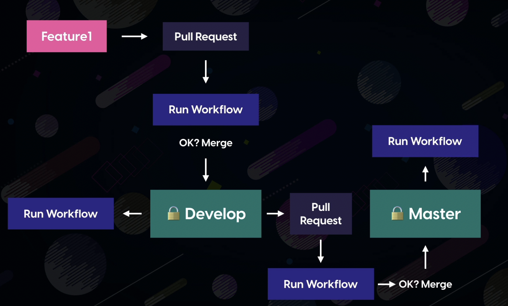
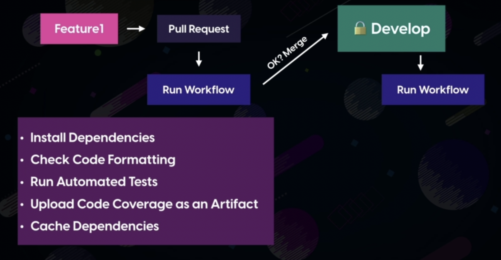
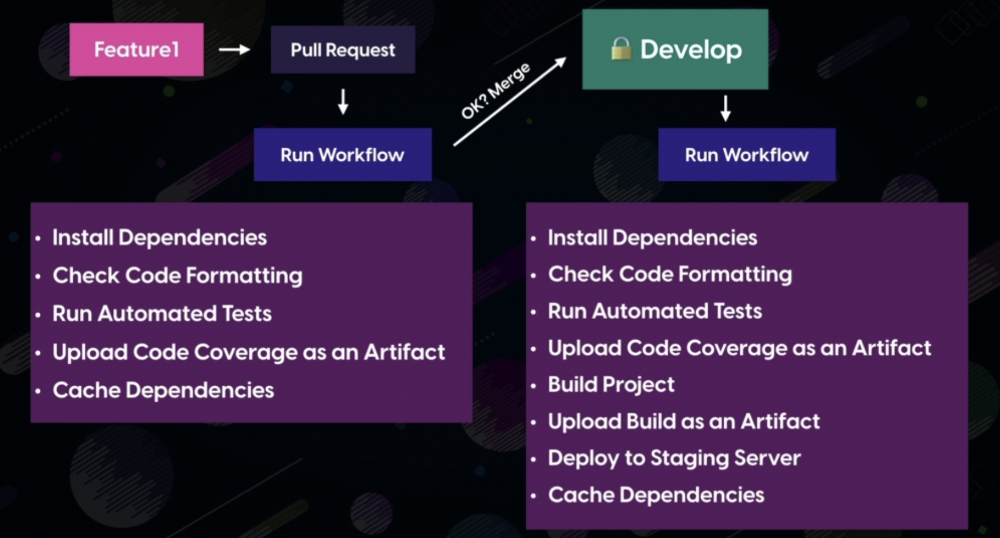
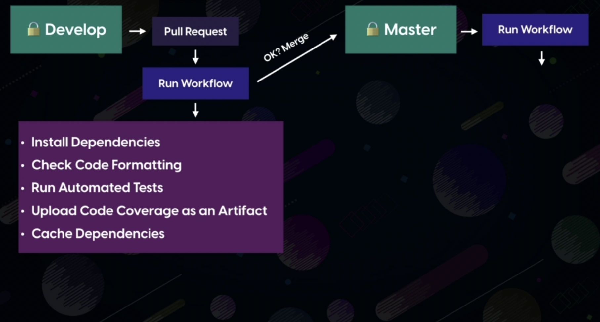
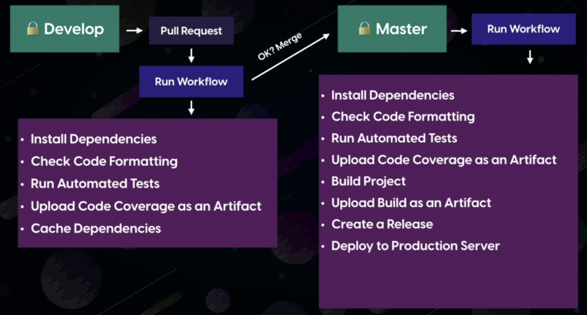

<style>
    section {
         font-size:18px;
         color: white;
     }

</style>

# CI/CD with GITHUB ACTIONS

---
# Repository Setup

- Showing all steps on react app. 
- Nothing extra added. App having code created by:
```
create react app - npx create-react-app react-app --use-npm
```
- Added "CODEOWNERS" file inside .github/workflows 
- Sample site deployed on surge. 
- Deployed on two links for production and develop.
- Generated test coverage file by:
```
CI=true npm run test -- --coverage
```
- Generated build file by:

```
npm run build
```

---

# Workflow Plan

- Master and Develop branch in protected state. No direct commits allowed in these branches.
- New changes can be incorporated in Master and Develop only by Pull Requests.
- Required workflows to be triggered on creating PR and on merging PR.

---



---

# How to make branches protected?

- Go to your repository settings
- Select "branches" menu
- Add rule as per your requirements

---

# Dissection of workflow plan
---



---



---


---



---

# Workflow for PULL_REQUEST - DEVELOP

- We are not triggering workflow on committing to any feature branch for the given app.
```
name: CI

on: 
  pull_request:
    branches: [develop]

jobs:
  build:
    runs-on: ubuntu-latest
    steps:
      - uses: actions/checkout@v2
      #This is option ( if you want different node version than the present in VM )
      - name: USE NODE JS
        uses: actions/setup-node@v1
        with:
          node-version: "12.x"
      - name: Install Dependencies
        run: npm ci # similar to npm install 
      - name: run our tests
        run: npm test -- --coverage
        env:
          CI: true

```
---
# Workflow for MERGE - DEVELOP

- There can be different workflow for this.
- But we make use of github contexts to acheive this in a single workflow
- Point to note that merging into the branch is as same as pushing into it.

```
name: CI

on: 
   pull_request:
     branches: [develop]
   push:
     branches: [develop] 
jobs:
  build:
    runs-on: ubuntu-latest
    steps:
      - uses: actions/checkout@v2
      - name: USE NODE JS
        uses: actions/setup-node@v1
        with:
          node-version: "12.x"
      - name: Install Dependencies
        run: npm ci # similar to npm install  
      - name: run our tests
        run: npm test -- --coverage
        env:
          CI: true
      - name: Build project
        if: github.event_name == 'push'
        run: npm run build
      - run: npm install -g surge
      - name: Deploying to Staging
        if: github.event_name == 'push'
        run: surge --project ./build --domain hateful-rose.surge.sh
        env:
          SURGE_LOGIN: ${{ secrets.SURGE_LOGIN }}
          SURGE_TOKEN: ${{ secrets.SURGE_TOKEN }}

```
---

# Dependencies Cache

- https://github.com/marketplace/actions/cache
- Similar to Checkout actions, we have Cache actions in GITHUB marketplace
- This action has to run before the installation of dependencies.
- In given code block, latest caching will happen only if there is change of OS or in package-lock.json file.
  - key is used to retrieve Cache

```
 - name: Cache node_modules
        uses: actions/cache@v1 
        with:
          path: ~/.npm
          key: ${{ runner.os }}-node-${{ hashFiles('**/package-lock.json') }}
          # extra keys that github can search for caches if github is unable to find cache using the key. 
          # There can be multiple restore keys. 
          # restore-keys: 
```
---

# Artifacts 

- We can also generate artifacts at the completion of workflows which can be code coverage files, build files, etc.

```
      - name: run our tests
        run: npm test -- --coverage
        env:
          CI: true
      - name: Upload Test Coverage
        uses: actions/upload-artifact@v1
        with:
          name: code-coverage
          path: coverage # path of the folder we want to upload
      - name: Build project
        if: github.event_name == 'push'
        run: npm run build
      - name: Upload Build Folder
        if: github.event_name == 'push'
        uses: actions/upload-artifact@v1
        with:
          name: build
          path: build # path of the folder we want to upload
```
---
# Complete Workflow involving pointers covered till this slide

```
name: CI

on: 
   pull_request:
     branches: [develop]
   push:
     branches: [develop]

jobs:
  build:
    runs-on: ubuntu-latest
    steps:
      - uses: actions/checkout@v2
      - name: USE NODE JS
        uses: actions/setup-node@v1
        with:
          node-version: "12.x"
      - name: Cache node_modules
        uses: actions/cache@v1
        with:
          path: ~/.npm
          key: ${{ runner.os }}-node-${{ hashFiles('**/package-lock.json') }} # key is used to retrieve cache.
          # restore-keys: 
```           
To Be Contd..          

---   
```                      
      - name: Install Dependencies
        run: npm ci # similar to npm install  
      - name: run our tests
        run: npm test -- --coverage
        env:
          CI: true
      - name: Upload Test Coverage
        uses: actions/upload-artifact@v1
        with:
          name: code-coverage
          path: coverage # path of the folder we want to upload
      - name: Build project
        if: github.event_name == 'push'
        run: npm run build
      - name: Upload Build Folder
        if: github.event_name == 'push'
        uses: actions/upload-artifact@v1
        with:
          name: build
          path: build # path of the folder we want to upload
      - run: npm install -g surge
      - name: Deploying to Staging
        if: github.event_name == 'push'
        run: surge --project ./build --domain hateful-rose.surge.sh
        env:
          SURGE_LOGIN: ${{ secrets.SURGE_LOGIN }}
          SURGE_TOKEN: ${{ secrets.SURGE_TOKEN }}
```
---
# Workflow for Production

In addition to the existing workflow there will be few extra steps:

- Triggering workflow for PR into master and merge into master.
- Deploying to Production

We can all extra steps in the same workflow by just adding few extra conditions for the master branch.

---
# Further enhancements
- Git message can be checked and put into check by using commitlint or commitizen
  - https://github.com/conventional-changelog/commitlint
  - https://github.com/commitizen/cz-cli
- New Issues can be created on workflows failure by using the curl command. 
- Badge can be assigned to your readme file to show build status
  - https://docs.github.com/en/actions/monitoring-and-troubleshooting-workflows/adding-a-workflow-status-badge